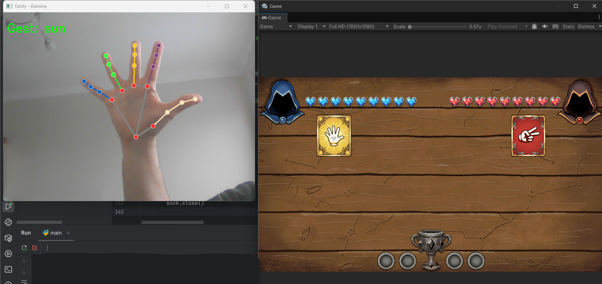
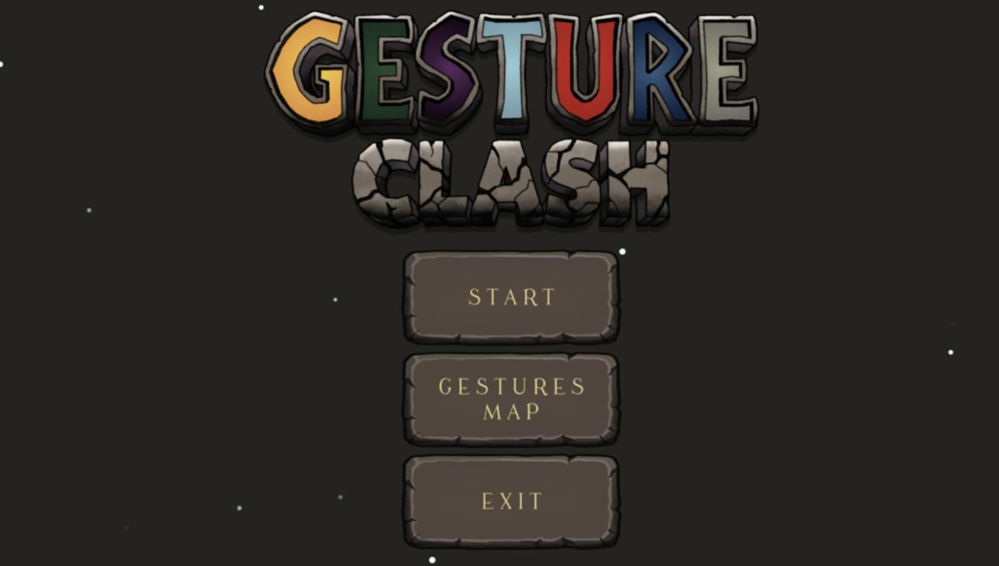
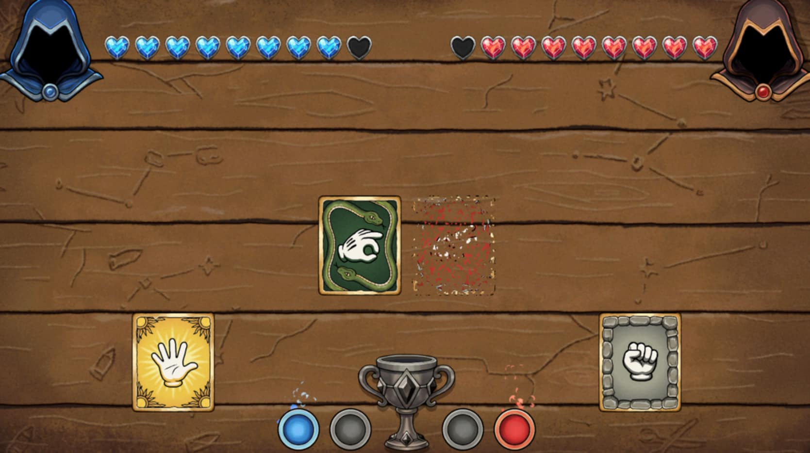
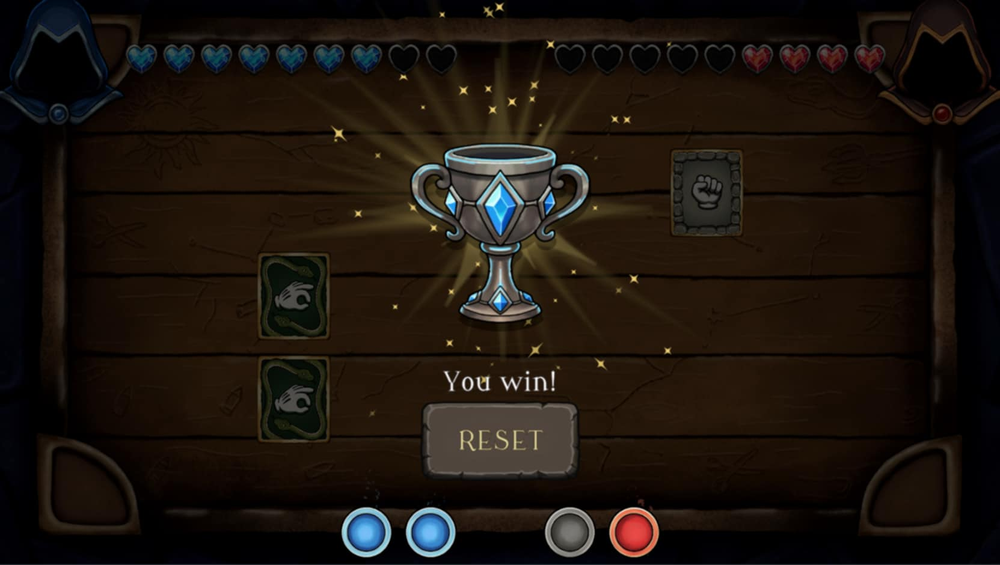

# Gesture Clash

Projekt łączy techniki rozpoznawania obrazu i uczenie maszynowe z interaktywną grą. Gra to rozbudowana wariacja gry "Kamień, papier, nożyce".

## 💡 Opis projektu

Celem projektu było stworzenie systemu, który w czasie rzeczywistym rozpoznaje gesty dłoni  i przekłada je na akcje w grze.

Gra polega na pojedynku z komputerem. Gracz wybiera gesty, które "wyśle" do walki, wykonując odpowiednie gesty do kamery. Następnie widząc co wybrał komputer może dokonać istatecznej korekty który gest zmierzy się z którym, końcowo dochodzi do walki gestów. Gra trwa do 3 zwycięstw. 

## 🏗 Architektura

1.  **Moduł Python (Klient):**
    * Pobiera obraz z kamery.
    * Wykrywa dłoń i rozpoznaje gest na podstawie wytrenowanego modelu SVM.
    * Wysyła informację do Unity.
2.  **Moduł Unity (Serwer):**
    * Odbiera gesty i spawnuje odpowiednie gesty-karty na stole.
    * Prowadzi rozgrywke.

## 🛠 Technologia i Wymagania

### Python
* **Wersja:** `3.12.5`

### Unity
* **Wersja:** `6000.0.60f1`

## 🧠 Algorytmika i Uczenie Maszynowe

### Pipeline rozpoznawania:
1.  Obraz z kamery trafia do biblioteki Google MediaPipe, która zwraca współrzędne (x, y) dla 21 punktów kluczowych dłoni.
2.  Współrzędne punktów są spłaszczane do wektora cech i przekazywane do klasyfikatora SVM z jądrem RBF. Model został wytrenowany na zbiorze danych własnych i z repozytorium Kaggle.
3.  Przed wysłaniem gestu do Unity wynik jest wybierany na podstawie histogramu złożoneog z odczytu danych.
4.  Po wysłaniu gestu system blokuje rozpoznawanie na 3 sekundy, aby gracz zdążył przygotować kolejny gest bez przypadkowego wysyłania stanów przejściowych.

## 🎮 Rozgrywka w Unity

Gra podzielona jest na fazy

1.  **Faza wyboru:** Gracz pokazuje gesty. Python wysyła sygnał, Unity tworzy gest-kartę.
2.  **Faza przestawiania** Gracz ma krótki czas na ręczne przestawienie kart myszką, aby skontrować przeciwnika.
3.  **Faza walki:** Karty biją się rzędami. Logika walki jest zaprojektowana na podstawie grafu skierowanego.
4.  **Faza podsumowania:** Podliczenie punktów i decyzja o zwycięstwie.

## 🚀 Instrukcja Uruchomienia

### 1. Uruchomienie Gry (Unity)
1.  Sklonuj repozytorium.
2.  Otwórz projekt w Unity.
3.  Uruchom scenę `MainMenuScene`. Gra sie uruchamia tylko od tej sceny.
4.  Kliknij **Play**. (Gesture Book zawiera graficzne przedstawienie grafu skierowanego aby poznać zasady przyznawania punktów)

### 2. Uruchomienie Detektora (Python)
1.  Upewnij się, że plik modelu `model_gesty.pkl` znajduje się w tym samym katalogu co skrypt.
2.  Zainstaluj odpowiednie moduły: mediapipe, pickle, cv2
4.  Uruchom skrypt główny.

### Main Menu

### Gameplay

### Koniec meczu

---
*Autorzy: Mateusz Gozdek, Mateusz Fundowicz, Oskar Firlej*
